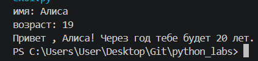
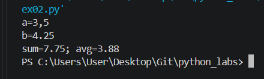
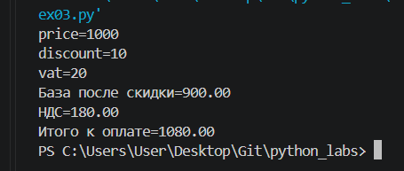
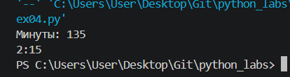
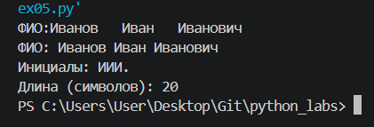
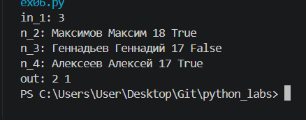

## ЛР1
## задание 1
### Программа запрашивает у пользователя его имя и возраст. Введенное значение возраста преобразуется в целое число с помощью int(). Затем программа выводит с помощью f-строки приветствие и рассчитывает, сколько лет пользователю исполнится через год, прибавляя к текущему возрасту единицу.

## задание 2
### Программа считывает два числа, введенных пользователем, и заменяет запятые на точки для дальнейшей корректной работой. Далее программа вычисляет их сумму и среднее арифметическое, сохраняя результаты в переменных sum и avg. В конце с помощью f-строки выводятся оба значения, округленные до двух знаков после запятой.

## задание 3
### Программа запрашивает у пользователя цену товара, размер скидки и НДС. Далее вычисляет стоимость товара после применения скидки, сумму налога и итоговую стоимость к оплате. С помощью f-строк результаты выводятся на экран с округлением до двух знаков после запятой.
 

## задание 4
### Програамма запрашивает у пользователя количество минут и преобразует его в целое число. Далее вычисляет полные часы путем целочисленного деления на 60 и оставшиеся минуты с помощью остатка от деления. В конуе на экран выводится результат в формате часы:минуты, причем минуты дополняются в случае чего ведущим нулем.

## задание 5
### Программа запрашивает у пользователя ФИО , разделяя введенную строку на части с помощью split(). затем программа формирует инициалы, извлекая первые буквы из фамилии, имени и отчества и переводит их в заглавные. В конце выводятся полученные инициалы, сокращенное ФИО и подсчитанная длина последней строки в символах.

## задание 6
### Программа запрашивает у пользователя кол-во строк для обработки и запускает два счетчика для подсчетов. В цикле программа считывает каждую строку, разбивает ее по пробелам и проверяет последнее слово. Для каждого условия срабатывает свой счетчик. В конце программа выводит кол-во занчений счетчика.

