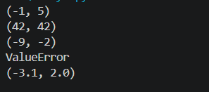
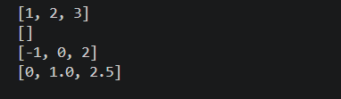
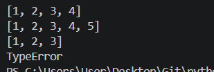
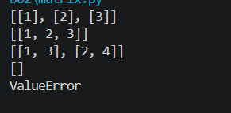
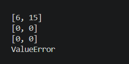
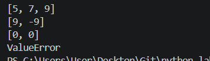
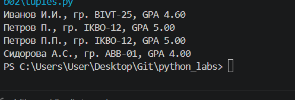

# ЛР2 — Коллекции и матрицы (list/tuple/set/dict)
## Задание A — arrays.py
### 1
```python
def min_max(nums: list[float | int]) -> tuple[float | int, float | int]:
    if not nums:
        raise ValueError
    nums.sort()
    return nums[0], nums[-1]
```
Функция min_max принимает список чисел. Если список пустой, она выдаёт ошибку. Потом она сортирует числа по возрастанию. После этого берёт первое число как минимум и последнее как максимум. И возвращает их вместе в виде кортежа.



### 2
```python 
def unique_sorted(nums: list[float | int]) -> list[float | int]:
    uni_set=set(nums)
    result=list(uni_set)
    n=len(result)
    for i in range (n):
        for j in range(i+1,n):
            if result[i]>result[j]:
                result [i], result[j] = result[j], result [i]
    return result
```
Функция unique_sorted принимает список чисел. Сначала она превращает его в множество, чтобы убрать все повторяющиеся значения. Затем множество снова преобразуется в список. После этого двойной цикл сравнивает элементы попарно и меняет их местами, если они стоят в неправильном порядке, то есть выполняется сортировка. В конце функция возвращает новый список, в котором нет дубликатов и числа идут по возрастанию.



### 3
```python
def flatten(mat: list[list | tuple]) -> list:
    result=[]
    for i in mat:
        if type(i) == list or type(i) == tuple:
            result.extend(i)
        else: 
            raise TypeError
    return result
```
Функция flatten принимает список mat, элементами которого должны быть списки или кортежи. Она создаёт пустой список result для сбора результата. Затем в цикле перебирает каждый элемент i из mat. Если i является списком или кортежем, его элементы добавляются в result через extend, иначе выбрасывается TypeError. В конце функция возвращает result - плоский список из элементов всех вложенных последовательностей.



## Задание B - matrix.py
### 1
```python
def transpose(mat: list[list[float | int]]) -> list[list]:
    if not mat:
        return []
    for i in mat:
        if len(i)!= len(mat[0]):
            raise ValueError
    return [list(i) for i in zip(*mat)]
```
Функция transpose принимает матрицу — список списков чисел. Если матрица пустая, возвращается пустой список. Затем проверяется, что все строки имеют одинаковую длину, иначе возбуждается ValueError. После проверок с помощью zip(*mat) столбцы исходной матрицы собираются в строки, и каждый кортеж преобразуется в список. В итоге возвращается новая матрица, где строки и столбцы поменяны местами.



### 2
```python
def row_sums(mat: list[list[float | int]]) -> list[list]:
    if not mat:
        return []
    for i in mat:
        if len(i)!= len(mat[0]):
            raise ValueError
    return [sum(i) for i in mat]
```
Функция row_sums принимает матрицу - список списков чисел. Если матрица пустая, она сразу возвращает пустой список. Затем проверяется, что все строки имеют одинаковую длину, иначе возбуждается ValueError. После проверки для каждой строки считается сумма её элементов. В конце возвращается список этих сумм.



### 3
```python 
def col_sums(mat: list[list[float | int]]) -> list[float]:
    for i in mat:
        if len(i)!=len(mat[0]):
            raise ValueError
    return [sum(i) for i in zip(*mat)]
```

Функция col_sums принимает матрицу — список списков чисел. Сначала она проверяет, что все строки имеют одинаковую длину, иначе возбуждает ValueError. Затем с помощью zip(*mat) столбцы собираются в кортежи, для каждого из них считается сумма. В конце возвращается список сумм по столбцам; для пустой матрицы цикл не выполняется, а zip() без аргументов даёт пустой результат, поэтому вернётся пустой список.



## Задание С - tuples.py
```python
def format_record(rec: tuple[str, str, float]) -> str:
    if not isinstance(rec, tuple) or len(rec) != 3:
        raise TypeError
    
    fio, group, gpa = rec

    if not isinstance(fio, str) or not isinstance(group, str):
        raise TypeError
    
    if not isinstance(gpa, (int, float)) or isinstance(gpa, bool):
        raise TypeError
    
    if not 0.0 <= gpa <= 5.0:
        raise ValueError
    
    parts = fio.split()
    if len(parts) < 2:
        raise ValueError
    
    group = group.strip()
    if not group:
        raise ValueError
    
    surname = parts[0].capitalize()
    initials = "".join(p[0].upper() + "." for p in parts[1:3])
    return f"{surname} {initials}, гр. {group}, GPA {gpa:.2f}"
```
Функция format_record принимает кортеж из трёх элементов — ФИО, группу и GPA. Сначала она проверяет, что это действительно кортеж из трёх частей, что ФИО и группа — строки, а GPA — число (не bool), и что GPA лежит в диапазоне от 0.0 до 5.0, иначе выбрасывает TypeError или ValueError. Затем ФИО разбивается на слова, из первого делается фамилия с заглавной буквы, а из следующих одного-двух слов — инициалы с точками. Группа очищается от лишних пробелов по краям, и если она пустая — тоже ошибка. В конце собирается строка вида «Фамилия И.О., гр. Группа, GPA X.XX», где GPA выводится с двумя знаками после запятой.



